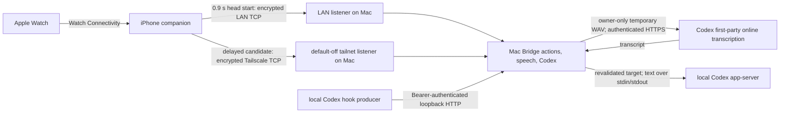

# Threat model

## 1. Overview

Wrist Remote carries user-triggered button actions, short microphone captures, foreground-dictation transcripts, and Codex task status and summaries between an Apple Watch, its paired iPhone, and a Mac Bridge. Direct iPhone-to-Mac transport gives LAN a 0.9-second head start, then races an explicitly configured Tailscale candidate if LAN is not yet ready. The current personal build is private-only: public Relay is excluded by `WRISTREMOTE_PRIVATE_ONLY = YES` and an `.invalid` Relay endpoint. It accepts only literal official-range Tailscale IPs and does not use DNS, Funnel, port forwarding, a public proxy, or a public listener.

Codex voice requires Internet access: the Watch streams original PCM through iPhone, the Mac writes an owner-only temporary WAV, and `CodexNativeVoiceTranscriber` sends it to the fixed first-party Codex transcription service using the signed-in account's in-memory app-server authentication. After target revalidation, returned text is queued through local app-server stdin/stdout. Private-only control describes inbound remote transport, not offline transcription. Foreground dictation remains a separate Speech-framework and temporary-pasteboard feature.

This model includes the Codex voice boundary used in source version `0.6.0`. The new foreground Watch LAN HTTP button path is described in [Phone and Watch connections](docs/en/phone-watch-connection.md); voice still uses iPhone. It distinguishes implemented controls from deployment obligations and pending real-device acceptance. It does not claim that VPN wake-up, Watch reachability, haptics, voice, route handoff, or identity recovery has passed on a particular device set.

### Components and source

| Component | Role and data flow | Representative source |
|---|---|---|
| Apple Watch app | Captures deliberate button/voice interactions, applies haptics, and exchanges live messages with the paired iPhone. Independent Internet mode is unavailable in the current private-only build. | [`WatchSessionController.swift`](apps/WristRemote/Watch/WatchSessionController.swift), [`WatchRemoteViews.swift`](apps/WristRemote/Watch/WatchRemoteViews.swift) |
| iPhone companion | Receives ordered Watch Connectivity messages, forwards actions/audio only while live state and profile revision match, manages mappings, and owns both direct Mac routes. | [`WatchRelayController.swift#L835-L942`](apps/WristRemote/iOS/WatchRelayController.swift#L835-L942), [`WatchRelayController.swift#L1307-L1416`](apps/WristRemote/iOS/WatchRelayController.swift#L1307-L1416) |
| Direct client | Gives Bonjour a 0.9-second head start, starts a validated Tailscale candidate when LAN is not yet ready, adopts the first-ready route, authenticates the Mac, proves a fail-closed iPhone installation identity, and encrypts frames. | [`WristBridgeConnection.swift#L985-L1189`](apps/WristRemote/iOS/WristBridgeConnection.swift#L985-L1189), [`WristBridgeConnection.swift#L1263-L1428`](apps/WristRemote/iOS/WristBridgeConnection.swift#L1263-L1428), [`WristBridgeConnection.swift#L2039-L2125`](apps/WristRemote/iOS/WristBridgeConnection.swift#L2039-L2125) |
| Mac Bridge direct server | Runs distinct LAN and optional tailnet listeners, authenticates and pairs the iPhone, decrypts accepted commands, and dispatches the dedicated Watch profile. | [`WristRemoteServer.swift#L43-L336`](apps/WristRemoteBridge/Sources/WristRemoteServer.swift#L43-L336), [`WristRemoteServer.swift#L510-L721`](apps/WristRemoteBridge/Sources/WristRemoteServer.swift#L510-L721) |
| Mutual identity protocol | Defines domain-separated, length-prefixed transcripts that bind the protocol roles, ephemeral keys, server identity, and client identity. | [`WristBridgeWireMessage.swift#L74-L149`](apps/WristRemote/Shared/WristBridgeWireMessage.swift#L74-L149) |
| Relay-capable source (inactive) | Remains in the source tree for a separately reviewed variant, but the current personal products exclude public Relay through the private-only build flag and `.invalid` endpoint. | [`InternetRelayClient.swift`](apps/WristRemoteBridge/Sources/InternetRelayClient.swift), [`WristRemoteRelay`](apps/WristRemoteRelay) |
| Local Codex hook | Receives bounded, Bearer-authenticated JSON only on loopback and passes accepted task events to the local coordinator. | [`CodexHookReceiver.swift#L5-L87`](apps/WristRemoteBridge/Sources/CodexHookReceiver.swift#L5-L87), [`CodexHookReceiver.swift#L200-L275`](apps/WristRemoteBridge/Sources/CodexHookReceiver.swift#L200-L275) |
| Codex audio inbox and transcriber | Accepts authenticated, sequenced Watch PCM only for an authorized existing target, writes a private temporary WAV, requests first-party online transcription, revalidates the target, and queues returned text through local app-server. | [`WatchCodexAudioInbox.swift`](apps/WristRemoteBridge/Sources/WatchCodexAudioInbox.swift), [`CodexNativeVoiceTranscriber.swift`](apps/WristRemoteBridge/Sources/CodexNativeVoiceTranscriber.swift), [`CodexAppServerClient.swift`](apps/WristRemoteBridge/Sources/CodexAppServerClient.swift) |

### Effective resources

| Deployment or workflow | Resource or capability | Configuration and precedence | Safe effective value or location | Readers, writers, or recipients | Enforcing control | Evidence or unknowns |
|---|---|---|---|---|---|---|
| LAN direct | Mac TCP listener | Code selects one approved non-tunnel candidate; no user wildcard override | One concrete RFC1918 IPv4, IPv4 link-local, or IPv6 ULA address on TCP `60927`; Bonjour `_wristremote._tcp` | Numeric LAN peers passing the source gate; application data only after mutual pairing | Concrete `requiredLocalEndpoint`, LAN source policy, mutual identity, ChaCha20-Poly1305 session | [`WristRemoteServer.swift#L43-L140`](apps/WristRemoteBridge/Sources/WristRemoteServer.swift#L43-L140), [`WristRemoteServer.swift#L246-L336`](apps/WristRemoteBridge/Sources/WristRemoteServer.swift#L246-L336), [`WristRemoteServer.swift#L525-L559`](apps/WristRemoteBridge/Sources/WristRemoteServer.swift#L525-L559) |
| Tailscale direct | Separate Mac TCP listener | Bridge-owned `tailnetAccessEnabled` defaults false; it does not replace the LAN listener | One concrete `utun` address in `100.64.0.0/10` or `fd7a:115c:a1e0::/48`, TCP `60927`; no Bonjour publication | Tailscale-range peers passing the tailnet gate; application data only after mutual pairing | Interface/range binding, source range gate, application identity and encryption | [`BridgePreferences.swift#L38-L59`](apps/WristRemoteBridge/Sources/BridgePreferences.swift#L38-L59), [`BridgePreferences.swift#L121-L124`](apps/WristRemoteBridge/Sources/BridgePreferences.swift#L121-L124), [`WristRemoteServer.swift#L142-L244`](apps/WristRemoteBridge/Sources/WristRemoteServer.swift#L142-L244), [`WristRemoteServer.swift#L565-L700`](apps/WristRemoteBridge/Sources/WristRemoteServer.swift#L565-L700) |
| iPhone private target | Tailscale IP configuration | User enables at runtime; validation runs before save and again on load; port is not configurable | Literal IP in `100.64.0.0/10` or `fd7a:115c:a1e0::/48`, fixed TCP `60927`, in a Bundle-derived iPhone Keychain service | iPhone direct client only | DNS/scheme/path/credential/port/public-address/unrelated-private-address rejection and Keychain storage | [`WristPrivateNetworkConfiguration.swift#L4-L119`](apps/WristRemote/iOS/WristPrivateNetworkConfiguration.swift#L4-L119), [`WristPrivateNetworkConfiguration.swift#L121-L149`](apps/WristRemote/iOS/WristPrivateNetworkConfiguration.swift#L121-L149) |
| Mac direct identity | Long-term P-256 private key | Created only when the dedicated Keychain item is absent; locked, unreadable, or corrupt storage is not replaced | Bundle-derived Keychain service with `AfterFirstUnlockThisDeviceOnly` accessibility | Mac Bridge process; public key and signatures go to the iPhone | Fail-closed load/create policy; both direct listeners require the key | [`WristRemoteServerIdentityStore.swift#L5-L77`](apps/WristRemoteBridge/Sources/WristRemoteServerIdentityStore.swift#L5-L77), [`WristRemoteServer.swift#L517-L527`](apps/WristRemoteBridge/Sources/WristRemoteServer.swift#L517-L527) |
| iPhone direct identity | Long-term P-256 private key | Created only when the dedicated Keychain item is absent; unreadable or corrupt storage is rejected; replacement requires a separately confirmed UI action | Bundle-derived iPhone Keychain service with `AfterFirstUnlockThisDeviceOnly` accessibility | iPhone direct client; public key and signatures go to the Mac | Fail-closed load/create policy; explicit reset makes the Mac require new approval | [`WristBridgeConnection.swift#L350-L360`](apps/WristRemote/iOS/WristBridgeConnection.swift#L350-L360), [`WristBridgeConnection.swift#L1182-L1198`](apps/WristRemote/iOS/WristBridgeConnection.swift#L1182-L1198), [`WristBridgeConnection.swift#L2039-L2125`](apps/WristRemote/iOS/WristBridgeConnection.swift#L2039-L2125), [`WristRemoteHomeView.swift#L206-L219`](apps/WristRemote/iOS/WristRemoteHomeView.swift#L206-L219) |
| iPhone trust state | Pinned Mac SHA-256 fingerprint | TOFU requires local iPhone approval and a Mac-approved `ready`; later saves cannot overwrite another fingerprint | Bundle-derived iPhone Keychain service with `AfterFirstUnlockThisDeviceOnly` accessibility | iPhone direct client; explicit **Forget trusted Mac** can delete it | Strict 64-character fingerprint validation, save-once semantics, mismatch/unavailable rejection | [`WristBridgeTrustedServerIdentityStore.swift#L4-L73`](apps/WristRemote/iOS/WristBridgeTrustedServerIdentityStore.swift#L4-L73), [`WristBridgeConnection.swift#L324-L348`](apps/WristRemote/iOS/WristBridgeConnection.swift#L324-L348), [`WristBridgeConnection.swift#L1263-L1408`](apps/WristRemote/iOS/WristBridgeConnection.swift#L1263-L1408) |
| Mac trust state | Trusted iPhone installation fingerprints | Explicit Mac approval adds a fingerprint; legacy UserDefaults values migrate one way into Keychain | Bundle-derived Mac Keychain service | Mac Bridge pairing logic | Signed client proof bound to server identity and current exchange; failed persistence sends `denied` before ready; trusted reconnect additionally requires the client to report that this Mac is pinned | [`BridgePreferences.swift#L10-L69`](apps/WristRemoteBridge/Sources/BridgePreferences.swift#L10-L69), [`BridgePreferences.swift#L131-L149`](apps/WristRemoteBridge/Sources/BridgePreferences.swift#L131-L149), [`WristRemoteServer.swift#L923-L948`](apps/WristRemoteBridge/Sources/WristRemoteServer.swift#L923-L948), [`WristRemoteServer.swift#L1181-L1238`](apps/WristRemoteBridge/Sources/WristRemoteServer.swift#L1181-L1238) |
| Mac installation | Signed Bridge app target | Default target is per-user; reviewed alternate target is an explicit CLI argument; optional Bundle-ID override lives only in ignored local xcconfig | Absolute, non-symlinked `.app`; existing and built Bundle IDs must match; zero running Bridge processes | Local developer invoking the installer | Fail-closed target canonicalization, Bundle-ID comparison, repeated process checks, no automatic kill | [`build-macos.sh#L15-L61`](scripts/build-macos.sh#L15-L61), [`build-macos.sh#L80-L116`](scripts/build-macos.sh#L80-L116), [`macos-install-safety.zsh#L36-L75`](scripts/lib/macos-install-safety.zsh#L36-L75), [`Local.xcconfig.example#L5-L9`](Config/Local.xcconfig.example#L5-L9) |
| Direct session | Ephemeral session key and application frames | New Curve25519 exchange for each connection; transcript hash is HKDF shared info | Process memory only; ChaCha20-Poly1305 sealed frames | Authenticated iPhone and Mac session | Server identity signature, client identity signature, transcript-bound KDF, strict handshake order | [`WristBridgeWireMessage.swift#L74-L149`](apps/WristRemote/Shared/WristBridgeWireMessage.swift#L74-L149), [`WristBridgeConnection.swift#L1250-L1357`](apps/WristRemote/iOS/WristBridgeConnection.swift#L1250-L1357), [`WristRemoteServer.swift#L1111-L1198`](apps/WristRemoteBridge/Sources/WristRemoteServer.swift#L1111-L1198), [`WristBridgeConnection.swift#L1839-L1876`](apps/WristRemote/iOS/WristBridgeConnection.swift#L1839-L1876), [`WristRemoteServer.swift#L1621-L1657`](apps/WristRemoteBridge/Sources/WristRemoteServer.swift#L1621-L1657) |
| Public-Relay exclusion | Build flag and endpoint sentinel | Personal build requires both gates | `WRISTREMOTE_PRIVATE_ONLY = YES`; Relay URL remains under reserved `.invalid` | Mac, iPhone, and Watch products | Build/configuration rejection, credential revocation, and no public fallback | Relay-capable source requires a separate security review and is not an active resource in this model |
| Codex integration | Local hook and bearer | Fixed loopback host/route and per-installation Keychain token | `127.0.0.1:60928/codex-hook`; request body at most 512 KiB | Same-host hook producers that possess the bearer | Loopback binding, exact POST route/content type, constant-time bearer comparison, bounded headers/body | [`CodexHookReceiver.swift#L5-L87`](apps/WristRemoteBridge/Sources/CodexHookReceiver.swift#L5-L87), [`CodexHookReceiver.swift#L200-L275`](apps/WristRemoteBridge/Sources/CodexHookReceiver.swift#L200-L275) |
| Codex voice | PCM stream, temporary WAV, online transcription, task text | Voice is enabled only for an authorized existing target; a new task first completes independent `thread/start` with no parent/fork relationship | `0700` Bridge-owned directory, `0600` WAV, at most two minutes; fixed first-party transcription endpoint, then text over initialized app-server stdio | Paired Watch/iPhone path, Mac Bridge, Codex online transcription service, local Codex app-server and selected task | Mac-backed packet acknowledgements; stream/target/revision checks before queueing; in-memory authentication; no redirects or disk HTTP cache; bounded response; no automatic retry; deletion after processing/cancel/disconnect and scoped stale cleanup | [`WatchCodexAudioInbox.swift`](apps/WristRemoteBridge/Sources/WatchCodexAudioInbox.swift), [`CodexNativeVoiceTranscriber.swift`](apps/WristRemoteBridge/Sources/CodexNativeVoiceTranscriber.swift), [`CodexAppServerClient.swift`](apps/WristRemoteBridge/Sources/CodexAppServerClient.swift) |

## 2. Threat Model, Trust Boundaries, and Assumptions

### Protected assets and security objectives

- command intent, button mappings, selected applications, and the integrity of foreground Mac input;
- microphone audio, foreground-dictation transcripts, Codex task metadata and summaries, and temporary Codex WAV files;
- Mac and iPhone installation private keys, pinned fingerprints, direct session keys, and local hook credentials;
- the invariant that an unrelated remote control, microphone pipeline, or input-device mapping is neither read nor changed;
- no public inbound Mac listener, no public Relay fallback, no offline command/audio queue, and no execution or automatic replay of stale work;
- explicit user approval before first trust and deliberate capture of Codex voice for the selected authorized target.

### Actors and attacker capabilities

| Actor | Realistic starting capability | Capability not assumed |
|---|---|---|
| Untrusted LAN peer | Discover Bonjour, connect to a reachable LAN address, send malformed or repeated handshake frames, and attempt availability attacks | No Apple-device Keychain access, no trusted iPhone private key, no approval on either screen |
| Tailnet peer or compromised tailnet policy | Reach TCP `60927` when Grants permit, influence tailnet routing, and generate connection attempts from a Tailscale-range source | No Wrist Remote identity merely because it belongs to the tailnet |
| Internet observer | Probe accidentally exposed listeners or public endpoints and observe ordinary Tailscale-service metadata available to the operator's deployment | No public listener or Relay route is part of the accepted private-only configuration |
| Same-user local process | Observe temporary foreground-dictation clipboard contents, unlocked task text, or the owner-readable temporary WAV using that logged-in account's authority | No cross-user or locked-Keychain bypass is assumed; audio, paths, authentication, and transcripts are not written to Bridge logs or ledgers or placed in process arguments |
| Physical user at pairing or recovery | Read both screens and approve or reject the same six-digit session; intentionally invoke **Forget trusted Mac** or **Reset this iPhone's pairing identity** | A remote peer is not assumed to possess this physical approval capability |
| Local developer or same-user installer process | Select a Mac application target, provide local build settings, and attempt an in-place upgrade | No permission to silently replace a different Bundle ID or terminate a running Bridge is assumed |
| Compromised Apple device or Mac account | Exercise permissions and access content after decryption | Endpoint compromise is a residual risk, not treated as a network-authentication bypass finding |

### Trust boundaries and implemented controls

1. **Watch → paired iPhone.** Watch Connectivity is trusted only for the paired Apple-device relationship. The iPhone still checks live reachability, active profile revision, voice stream identity, and Mac connection before forwarding actions or audio ([`WatchRelayController.swift#L835-L942`](apps/WristRemote/iOS/WatchRelayController.swift#L835-L942)).
2. **iPhone → LAN listener.** The LAN is untrusted. A concrete local bind and numeric source gate reduce exposure; protocol identity and encrypted framing remain mandatory ([`WristRemoteServer.swift#L43-L140`](apps/WristRemoteBridge/Sources/WristRemoteServer.swift#L43-L140), [`WristRemoteServer.swift#L246-L336`](apps/WristRemoteBridge/Sources/WristRemoteServer.swift#L246-L336)).
3. **iPhone → tailnet listener.** Tailscale supplies reachability, not Wrist Remote authentication. The listener is separate and default-off, but all mutual identity and application encryption controls are identical to LAN ([`WristRemoteServer.swift#L565-L700`](apps/WristRemoteBridge/Sources/WristRemoteServer.swift#L565-L700)).
4. **Mutual TOFU and later reconnect.** On first use, the iPhone validates the Mac signature, shows a fingerprint and code, and requires local approval. The Mac separately approves the same code and stores the signed iPhone identity; a failed trust-store write sends `denied` and cannot become ready. Later automatic approval occurs only when the Mac trusts the iPhone fingerprint and the iPhone declares it has already pinned this Mac. Both long-term identity loaders reject unreadable or corrupt items instead of silently rotating them ([`WristBridgeConnection.swift#L1263-L1428`](apps/WristRemote/iOS/WristBridgeConnection.swift#L1263-L1428), [`WristBridgeConnection.swift#L2039-L2125`](apps/WristRemote/iOS/WristBridgeConnection.swift#L2039-L2125), [`WristRemoteServer.swift#L923-L948`](apps/WristRemoteBridge/Sources/WristRemoteServer.swift#L923-L948), [`WristRemoteServer.swift#L1181-L1238`](apps/WristRemoteBridge/Sources/WristRemoteServer.swift#L1181-L1238)).
5. **Public-Relay exclusion.** The active personal build requires both the private-only build/configuration flag and reserved `.invalid` endpoint. Relay-capable source is not an accepted runtime path, and connection failure never enables it implicitly.
6. **Local Codex hook, target selection, and online voice.** The hook is loopback-only and Bearer-authenticated. Conversation titles and workspace labels are sanitized before entering the Watch catalog; canonical paths stay on the Mac. New tasks use independent `thread/start` with no parent/fork identifier and become existing targets before voice is enabled. During a live stream, Watch delivery advances only after a Mac-backed acknowledgement. The Mac writes a `0600` WAV in a `0700` directory, requests transcription at the fixed first-party endpoint with in-memory app-server authentication, and revalidates the exact destination before queueing text over initialized stdio, not argv. Redirects, disk HTTP caching, and automatic retries are disabled. Failure, cancellation, or disconnect deletes partial audio and does not auto-replay. Foreground dictation alone uses Speech and the temporary pasteboard.
7. **Local build → installed Mac Bridge.** The installer accepts only a canonical absolute `.app` target, refuses symlinks and Bundle-ID mismatches, and checks for every running Bridge before build, replacement, and launch. It does not kill a process to force installation ([`build-macos.sh#L15-L61`](scripts/build-macos.sh#L15-L61), [`build-macos.sh#L80-L116`](scripts/build-macos.sh#L80-L116), [`macos-install-safety.zsh#L36-L75`](scripts/lib/macos-install-safety.zsh#L36-L75)).

### Deployment obligations and assumptions

- The intended iPhone and Mac belong to the intended tailnet; the configured endpoint is a literal official-range Tailscale IP, and VPN On Demand is configured for the intended Wi-Fi/cellular behavior. DNS endpoints are rejected.
- A least-privilege Tailscale Grant permits only the intended source to reach the intended Mac on `tcp:60927`. Grants are additive, so broader matching rules must be reviewed.
- Tailscale Funnel, router port forwarding, public proxies, UPnP/NAT-PMP exposure, and public wildcard listeners remain disabled.
- Apple, Tailscale, device approval, key expiry, local data retention, and incident response remain operator responsibilities.
- An upgrade from a release without Mac identity pinning requires one explicit two-ended pairing. It is not safe to auto-trust the first post-upgrade network response.
- An identity mismatch stays blocked unless the operator independently verifies an intentional Bridge reinstall or Keychain reset. Only then may the operator use **Forget trusted Mac** and repeat two-ended pairing.
- An iPhone identity reset is used only after independent confirmation that the identity item is damaged or that a new client identity is intended. The Mac must approve the resulting new iPhone fingerprint; the reset is not a shortcut around an unexplained trust failure.
- A developer using an alternate Mac install target must verify its absolute path and Bundle ID, configure any legacy Bundle-ID override only in ignored local xcconfig, and quit every Bridge normally before installing. The script deliberately does not resolve target ambiguity by terminating processes.
- Official-range Tailscale IP validation narrows accidental redirection but does not replace the pinned P-256 application identity.
- A personal build must set `WRISTREMOTE_PRIVATE_ONLY = YES` and keep `WristRemoteRelayBaseURL` at the reserved `.invalid` sentinel. The Mac removes old Relay credentials and sends an explicit tombstone. The iPhone and Watch persist revocation in both UserDefaults and a separate Keychain marker before deleting the credential, so ordinary restarts and uninstall/reinstall cycles that retain Keychain items cannot silently restore it.
- CI and deterministic tests do not establish real-device VPN, Watch Connectivity, permission, haptic, microphone, or handoff behavior.

Official operator references: [Tailscale reserved IP addresses](https://tailscale.com/docs/reference/reserved-ip-addresses), [VPN On Demand](https://tailscale.com/docs/features/client/ios-vpn-on-demand), [Grants](https://tailscale.com/docs/features/access-control/grants), [Funnel](https://tailscale.com/docs/features/tailscale-funnel), and [Apple Watch Connectivity](https://developer.apple.com/documentation/watchconnectivity).

### Non-goals

Wrist Remote is not an anonymity network, mobile-device-management system, general remote shell, Tailscale client, Termius integration, multi-tenant hosted service, or permission-bypass mechanism. It does not turn a standalone cellular Watch into a tailnet node. Termius may be used for separately authorized SSH maintenance, but it is not an application transport and receives no Wrist Remote identity or E2E credential.

## 3. Attack Surface, Mitigations, and Attacker Stories

The rows below are threat hypotheses and coverage outcomes, not claims of validated vulnerabilities.

| Priority | Scenario and capability gain | Prerequisites | Impact | Existing controls | Mitigation or operator action | Evidence |
|---|---|---|---|---|---|---|
| P1 | A LAN/tailnet adversary or route attacker impersonates the Mac and gains action/audio plaintext | Attacker can intercept or redirect the connection and defeat server authentication or persuade the user to reset trust | Command substitution, audio disclosure, false task data | Literal official-range Tailscale IP gate, Mac P-256 signature, transcript-bound KDF, iPhone pinned fingerprint, mismatch fail-closed, two-ended first approval | Never reset an unexplained mismatch; verify an intended reinstall out of band before **Forget trusted Mac** | [`WristBridgeConnection.swift#L1263-L1408`](apps/WristRemote/iOS/WristBridgeConnection.swift#L1263-L1408), [`WristRemoteServerIdentityStore.swift#L17-L59`](apps/WristRemoteBridge/Sources/WristRemoteServerIdentityStore.swift#L17-L59) |
| P1 | An unauthorized client executes Mac actions by spoofing a trusted iPhone | Attacker reaches a listener and can forge the trusted client's P-256 proof or steal its private key | Integrity loss in foreground input and selected app actions | Signed client proof binds both ephemeral keys and server identity; Mac stores the approved fingerprint or denies before ready; application frames require the session key | Protect Apple-device Keychain and revoke/re-pair after endpoint compromise | [`WristBridgeWireMessage.swift#L91-L139`](apps/WristRemote/Shared/WristBridgeWireMessage.swift#L91-L139), [`WristRemoteServer.swift#L923-L948`](apps/WristRemoteBridge/Sources/WristRemoteServer.swift#L923-L948), [`WristRemoteServer.swift#L1181-L1238`](apps/WristRemoteBridge/Sources/WristRemoteServer.swift#L1181-L1238) |
| P1 | TCP `60927` becomes publicly reachable | Operator adds Funnel, port forwarding, public proxying, or code regresses to wildcard binding | Expands handshake/DoS surface to the Internet; identity controls still gate actions | Separate concrete LAN/tailnet binds; tailnet listener default-off; no Funnel integration | Keep prohibited exposure disabled and verify the bound address during release acceptance | [`WristRemoteServer.swift#L525-L700`](apps/WristRemoteBridge/Sources/WristRemoteServer.swift#L525-L700), [`BridgePreferences.swift#L121-L124`](apps/WristRemoteBridge/Sources/BridgePreferences.swift#L121-L124) |
| P2 | An allowed tailnet peer floods incomplete handshakes or approval prompts | Tailnet Grant is broad enough to reach `60927` | Availability loss or user-confusion pressure, without command authority | Tailscale source gate, maximum eight unauthenticated clients, 30-second handshake timeout, identity proof before approval | Restrict Grants, remove unknown devices, and investigate repeated prompts | [`WristRemoteServer.swift#L343-L344`](apps/WristRemoteBridge/Sources/WristRemoteServer.swift#L343-L344), [`WristRemoteServer.swift#L665-L700`](apps/WristRemoteBridge/Sources/WristRemoteServer.swift#L665-L700), [`WristRemoteServer.swift#L891-L908`](apps/WristRemoteBridge/Sources/WristRemoteServer.swift#L891-L908) |
| P2 | A stale action or partial audio stream executes after reconnection | Attacker captures frames or a device automatically retries old work | Unexpected delayed action or unintended voice submission | Direct sessions use fresh ephemeral keys and authenticated frames; audio packets require ordered Mac-backed acknowledgements; disconnect cancels and removes partial Codex audio; there is no offline queue | Treat delivery failure as non-delivery and retry only by deliberate user action or a new recording | [`WatchRelayController.swift#L984-L1121`](apps/WristRemote/iOS/WatchRelayController.swift#L984-L1121), [`WatchCodexAudioInbox.swift#L157-L216`](apps/WristRemoteBridge/Sources/WatchCodexAudioInbox.swift#L157-L216) |
| P2 | A public Relay or listener is accidentally enabled in the personal build | One private-only gate is removed, an endpoint is changed, or a public exposure feature is added | Expands metadata, authentication, and availability attack surface beyond the accepted private boundary | Independent private-only build flag and `.invalid` endpoint; concrete LAN/tailnet listeners; credential revocation; no Funnel integration | Stop release, restore both gates, remove old credentials, and verify no public request or listener on real devices | Configuration and real-device release gate |
| P2 | A same-host process sends forged Codex task events | Process can reach loopback and obtains the hook bearer | False task state or summaries shown on Watch | Per-installation Keychain bearer, exact loopback bind/route, content-type and size limits, constant-time token comparison | Rotate/remove compromised local credentials and treat same-user compromise as an endpoint incident | [`CodexHookReceiver.swift#L44-L87`](apps/WristRemoteBridge/Sources/CodexHookReceiver.swift#L44-L87), [`CodexHookReceiver.swift#L200-L275`](apps/WristRemoteBridge/Sources/CodexHookReceiver.swift#L200-L275) |
| P3 | Identity recovery is abused as a social-engineering bypass | User is persuaded to forget the Mac or reset the iPhone identity after an unexplained failure | Trust can transfer after the user later approves an attacker's replacement identity | Separate destructive confirmations explain scope; two-ended approval remains required; neither action changes mappings | Require out-of-band verification of an intentional reinstall, damaged item, or deliberate identity replacement and investigate otherwise | [`WristRemoteHomeView.swift#L180-L219`](apps/WristRemote/iOS/WristRemoteHomeView.swift#L180-L219), [`WristBridgeConnection.swift#L324-L360`](apps/WristRemote/iOS/WristBridgeConnection.swift#L324-L360) |
| P3 | A local install replaces the wrong Bridge or leaves two Bridges racing for TCP `60927` | Developer supplies an unintended target, mismatched legacy Bundle ID, or installs while a Bridge is running | Availability loss, wrong app replacement, or connection to an unintended local instance | Absolute non-symlink target, Bundle-ID equality, repeated all-process checks, unresolved-process rejection, no automatic kill | Verify the target and any local Bundle-ID override; quit every Bridge normally before retrying | [`build-macos.sh#L15-L61`](scripts/build-macos.sh#L15-L61), [`build-macos.sh#L80-L116`](scripts/build-macos.sh#L80-L116), [`macos-install-safety.zsh#L36-L75`](scripts/lib/macos-install-safety.zsh#L36-L75) |
| P3 | New private routing modifies an unrelated remote's mappings | Implementation accidentally shares identifiers, stores, service names, or event interception | Existing remote behavior changes | Dedicated Bundle IDs, `_wristremote._tcp`, ports, Keychain services, preferences, and 12-button profile; Watch relay sends only its own events | Preserve source-isolation tests and perform before/after real-device acceptance | [`apps/WristRemote/project.yml#L22-L105`](apps/WristRemote/project.yml#L22-L105), [`apps/WristRemoteBridge/project.yml#L21-L79`](apps/WristRemoteBridge/project.yml#L21-L79), [`WatchRelayController.swift#L835-L891`](apps/WristRemote/iOS/WatchRelayController.swift#L835-L891) |
| P3 | Sensitive data appears to the same logged-in user through the temporary dictation clipboard, owner-readable temporary WAV, or unlocked task screen | Same-user software or unlocked-screen observer is present | Local privacy disclosure, not a network authentication bypass | Generic notifications; `0700` audio directory and `0600` WAV; no Bridge audio/transcript log or ledger; text submission over stdio; scoped deletion; conditional clipboard restore for foreground dictation | Avoid dictating secrets into foreground apps, keep the Mac account protected, and treat same-user compromise separately | [`WatchCodexAudioInbox.swift`](apps/WristRemoteBridge/Sources/WatchCodexAudioInbox.swift), [`CodexNativeVoiceTranscriber.swift`](apps/WristRemoteBridge/Sources/CodexNativeVoiceTranscriber.swift), [`CodexAppServerClient.swift`](apps/WristRemoteBridge/Sources/CodexAppServerClient.swift) |

### Residual risks

- A compromised Apple device or logged-in Mac account can access content after decryption and exercise granted Accessibility, microphone, or speech-recognition permissions.
- Tailscale may observe account, device, control-plane, and transport metadata according to its service and operator settings. Application encryption does not provide anonymity.
- A broad tailnet policy can expose `60927` to more peers than intended. Pairing still protects command authority, but availability attacks and approval pressure remain possible.
- iOS permits only one On Demand VPN at a time. Captive portals, restarts, suspended companion state, or another VPN can make the private route unavailable.
- Keychain deletion, an explicit iPhone identity reset, or a Bundle ID change intentionally creates a new installation identity and therefore requires explicit pairing; identity continuity cannot survive replacement or deletion of the identity itself. Corrupt or unreadable identity items cause availability loss until recovered because silent rotation is intentionally forbidden.
- Relay-capable source remains in the repository, but Cloudflare and public Relay are outside the effective private-only deployment. A separately enabled variant requires a new threat-model and acceptance review.
- General foreground dictation briefly places its transcript on the macOS clipboard. Codex titles and summaries remain visible while the authorized Watch or Mac screen is unlocked. Codex audio briefly exists as an owner-readable local WAV and is sent to Codex's first-party transcription service; returned text exists in Bridge memory and is submitted to the selected Codex task. Bridge cleanup and log exclusions do not erase submitted task text or govern Codex service retention, and do not protect against a process already acting as the same Mac user.

### Validation status

Source inspection and automated tests can validate deterministic endpoint filtering, transcript construction, signature checks, fail-closed identity loading, save-once trust, persistence-failure denial, install-target guards, identity mismatch rejection, listener separation, frame encryption, and no-queue behavior. They do not prove the complete device path.

Before release, validate on the intended Mac, iPhone, and Watch:

1. LAN receives a 0.9-second head start. If it is not ready and adopted by then, the Tailscale candidate starts; the first-ready candidate is adopted and the other is cancelled. An adopted route is not preempted, and the next reconnect cycle starts LAN-first again. Moving the iPhone off LAN reaches the Mac through Tailscale without a public listener.
2. First use and upgrade from the previous trust flow require the same six-digit code and separate approval on iPhone and Mac.
3. A pinned reconnect succeeds without a new approval, while a substituted Mac key, invalid signature, unsigned client, unreadable/corrupt identity or trust item, failed Mac trust-store write, and out-of-range source are rejected before ready.
4. **Forget trusted Mac** and **Reset this iPhone's pairing identity** are separate, destructive, confirmed actions. Neither changes endpoints or mappings; the relevant replacement identity works only after the required approval, and a reset iPhone is treated as new by the Mac.
5. An alternate Mac install target accepts only a matching Bundle ID. Any running or unresolved Bridge blocks installation without being killed, and no second Bridge retains or races for TCP `60927`.
6. Disabling Tailscale causes immediate non-delivery with no later replay. VPN On Demand behavior is verified across the intended Wi-Fi/cellular transitions.
7. Watch haptics, button phases, profile revisions, Chinese foreground dictation, recent-conversation browsing, destination selection, and Watch/iPhone reachability remain correct. New-task creation uses independent `thread/start` with no parent/fork relationship and becomes an existing target before voice is enabled. Codex voice uses signed-in first-party online transcription and queues text only after exact-target revalidation; every packet receives a Mac-backed acknowledgement, temporary audio is removed, and disconnect never causes automatic replay.
8. The existing unrelated remote control and microphone/input configuration have identical mappings and behavior before and after installation.
9. A Watch with no reachable iPhone does not report Tailscale availability. With `WRISTREMOTE_PRIVATE_ONLY = YES` and the Relay URL left at `.invalid`, historical Relay credentials are purged and no public-Relay request is attempted; independent cellular control is intentionally unavailable. User-requested Codex online transcription is a separate outbound service, not a remote-control fallback. Tailscale accepts only a literal official-range IP and rejects DNS, Funnel/public endpoints, and unrelated addresses.

These real-device gates are pending. The repository must not claim that they have passed until the intended hardware and deployment have been observed end to end.

## 4. Severity Calibration

| Severity | Repository-specific example | Counterexample or reducing control |
|---|---|---|
| Critical | A default-supported remote path allows an unauthenticated Internet attacker to execute arbitrary privileged local code without user action and across installations | A public connection attempt that is rejected before pairing, or behavior requiring an already compromised administrator account, is not Critical |
| High | A realistic LAN/tailnet attacker can forge a pinned Mac or trusted iPhone identity and thereby execute mapped actions or obtain microphone/task plaintext | Route influence alone is not High when the P-256 pin mismatch blocks the session; availability-only impact normally reduces severity |
| Medium | A reachable unauthorized peer can sustain meaningful denial of service, repeatedly pressure pairing UI, or exploit an accidentally exposed public listener without obtaining command authority | A transient failed connection with bounded retry and no queued action or audio is ordinary availability behavior, not automatically a vulnerability |
| Low | Same-user metadata, temporary clipboard exposure, notification-preview disclosure, verbose local diagnostics, or a minor hardening gap with no new command authority | Behavior explicitly initiated by and visible only to the already authorized user may be informational rather than a security finding |

Severity depends on actual reachability, required user approval, attacker starting privileges, endpoint compromise, and effective cryptographic and policy controls. Missing real-device evidence lowers confidence; it does not by itself lower the impact of a source-backed failure. Conversely, a hypothetical story is not a finding until its prerequisites and control failure are validated.

---

Repository: wrist-remote
Version: codex-security-snapshot/v1:sha256:43d7f7f2c248621f0bb70db2345ae0f0dfd2bb608eff840a3a0da0fe9f4c1e0b
